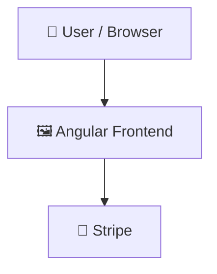

# E-commerce-MEAN-project

      

## 📑 Table of Contents

- [📝 Description](#-description)
- [📸 Screenshots](#-screenshots)
- [🛠️ Tech Stack](#️-tech-stack)
- [🏗️ Architecture](#️-architecture)
- [⚡ Quick Start](#-quick-start)
- [📦 Key Dependencies](#-key-dependencies)
- [🚀 Available Scripts](#-available-scripts)
- [📁 Project Structure](#-project-structure)
- [🛠️ Development Setup](#️-development-setup)
- [🧪 Testing](#-testing)
- [👥 Contributors](#-contributors)
- [🤝 Contributing](#-contributing)

## 📝  Description

E-commerce-MEAN-project — a frontend web app built with Angular, Tailwind CSS, TypeScript.

## 📸 Screenshots


## 🛠️ Tech Stack

- 🅰️ **Angular**
- 🌬️ **Tailwind CSS**
- 📘 **TypeScript**

**Notable libraries:** Stripe, Vitest

## 🏗️ Architecture

A high-level view of how the main pieces fit together:



## ⚡ Quick Start

```bash

# 1. Clone the repository
git clone https://github.com/OmarAliSiad/E-commerce-MEAN-project.git

# 2. Install dependencies
npm install

# 3. Start the dev server
npm run start
```

## 📦 Key Dependencies

```
@angular/common: ^21.2.0
@angular/compiler: ^21.2.0
@angular/core: ^21.2.0
@angular/forms: ^21.2.0
@angular/platform-browser: ^21.2.0
@angular/router: ^21.2.0
@stripe/stripe-js: ^9.0.0
rxjs: ~7.8.0
tslib: ^2.3.0
```

## 🚀 Available Scripts

- **ng** — `npm run ng`
- **start** — `npm run start`
- **build** — `npm run build`
- **watch** — `npm run watch`
- **test** — `npm run test`

## 📁 Project Structure

```
.
├── client
│   ├── angular.json
│   ├── package.json
│   ├── public
│   │   ├── favicon.ico
│   │   └── images
│   │       └── home
│   │           └── hero-door-handle.jpg
│   ├── src
│   │   ├── app
│   │   │   ├── app.config.ts
│   │   │   ├── app.css
│   │   │   ├── app.html
│   │   │   ├── app.routes.ts
│   │   │   ├── app.spec.ts
│   │   │   ├── app.ts
│   │   │   ├── core
│   │   │   │   ├── guards
│   │   │   │   │   └── ...
│   │   │   │   ├── interceptors
│   │   │   │   │   └── ...
│   │   │   │   └── services
│   │   │   │       └── ...
│   │   │   ├── features
│   │   │   │   ├── admin
│   │   │   │   │   └── ...
│   │   │   │   ├── auth
│   │   │   │   │   └── ...
│   │   │   │   ├── cart
│   │   │   │   │   └── ...
│   │   │   │   ├── customer
│   │   │   │   │   └── ...
│   │   │   │   ├── home
│   │   │   │   │   └── ...
│   │   │   │   ├── orders
│   │   │   │   │   └── ...
│   │   │   │   ├── payment
│   │   │   │   │   └── ...
│   │   │   │   ├── products
│   │   │   │   │   └── ...
│   │   │   │   └── seller
│   │   │   │       └── ...
│   │   │   ├── layouts
│   │   │   │   ├── admin-layout
│   │   │   │   │   └── ...
│   │   │   │   ├── customer-layout
│   │   │   │   │   └── ...
│   │   │   │   └── main-layout
│   │   │   │       └── ...
│   │   │   └── shared
│   │   │       ├── components
│   │   │       │   └── ...
│   │   │       ├── directives
│   │   │       │   └── ...
│   │   │       ├── models
│   │   │       │   └── ...
│   │   │       └── pipes
│   │   │           └── ...
│   │   ├── environments
│   │   │   ├── environment.development.ts
│   │   │   └── environment.ts
│   │   ├── index.html
│   │   ├── main.ts
│   │   └── styles.css
│   ├── tsconfig.app.json
│   ├── tsconfig.json
│   └── tsconfig.spec.json
└── server
    ├── app.js
    ├── config
    │   └── cloudinary.js
    ├── config.env.example
    ├── controllers
    │   ├── authController.js
    │   ├── cartController.js
    │   ├── categoryController.js
    │   ├── checkoutController.js
    │   ├── orderController.js
    │   ├── paymentController.js
    │   ├── productController.js
    │   ├── reviewController.js
    │   └── userController.js
    ├── index.js
    ├── middlewares
    │   ├── attachImageUrl.js
    │   ├── authenticate.js
    │   ├── errorHandler.js
    │   ├── rateLimiter.js
    │   ├── restrictTo.js
    │   ├── upload.js
    │   └── validate.js
    ├── models
    │   ├── Cart.js
    │   ├── Category.js
    │   ├── Order.js
    │   ├── Product.js
    │   ├── Review.js
    │   ├── User.js
    │   └── payment.js
    ├── package.json
    ├── public
    │   └── uploads
    │       └── products
    │           ├── 1774584941920-download.jpeg
    │           └── 1774584941922-download.jpeg
    ├── routes
    │   ├── authRoutes.js
    │   ├── cartRoutes.js
    │   ├── categoryRoutes.js
    │   ├── checkoutRoutes.js
    │   ├── orderRoutes.js
    │   ├── paymentRoutes.js
    │   ├── productRoutes.js
    │   ├── reviewRoutes.js
    │   └── userRoutes.js
    ├── schemas
    │   ├── Category
    │   │   ├── createCategorySchema.js
    │   │   ├── index.js
    │   │   └── updateCategorySchema.js
    │   ├── Order
    │   │   ├── createOrderSchema.js
    │   │   ├── index.js
    │   │   └── updateOrderStatusSchema.js
    │   ├── Product
    │   │   ├── createProductSchema.js
    │   │   ├── index.js
    │   │   └── updateProductSchema.js
    │   ├── User
    │   │   ├── createUserSchema.js
    │   │   ├── index.js
    │   │   ├── loginSchema.js
    │   │   ├── updateUserPasswordSchema.js
    │   │   └── updateUserSchema.js
    │   └── payment
    │       └── payment.schema.js
    ├── seed.js
    ├── services
    │   ├── authServices.js
    │   ├── cartService.js
    │   ├── categoryService.js
    │   ├── checkoutService.js
    │   ├── emailService.js
    │   ├── orderService.js
    │   ├── paymentservice.js
    │   ├── productService.js
    │   └── userServices.js
    ├── templates
    │   ├── orderPlaced.html
    │   ├── orderStatus.html
    │   ├── sellerApproved.html
    │   └── verifyEmail.html
    ├── test-joi.js
    └── utils
        ├── APIError.js
        ├── checkPermissions.js
        ├── createTokenUser.js
        ├── jwt.js
        └── throwIfNotFound.js
```

## 🛠️ Development Setup

### Node.js / JavaScript
1. Install Node.js (v18+ recommended)
2. Install dependencies: `npm install` (or `yarn` / `pnpm install` / `bun install`)
3. Start the dev server: see the **Quick Start** above

## 🧪 Testing

This project uses **Vitest** for testing.

```bash
npm run test
```

## 👥 Contributors

Thanks to everyone who has contributed to this project:

<p align="left">
<a href="https://github.com/OmarAliSiad" title="OmarAliSiad"></a>
<a href="https://github.com/Ramadan-Elgamal" title="Ramadan-Elgamal"></a>
<a href="https://github.com/mohamedahmed-dev" title="mohamedahmed-dev"></a>
<a href="https://github.com/elsayedfarg" title="elsayedfarg"></a>
</p>

[See the full list of contributors →](https://github.com/OmarAliSiad/E-commerce-MEAN-project/graphs/contributors)

## 👥 Contributing

Contributions are welcome! Here's the standard flow:

1. **Fork** the repository
2. **Clone** your fork: `git clone https://github.com/OmarAliSiad/E-commerce-MEAN-project.git`
3. **Branch**: `git checkout -b feature/your-feature`
4. **Commit**: `git commit -m 'feat: add some feature'`
5. **Push**: `git push origin feature/your-feature`
6. **Open** a pull request

Please follow the existing code style and include tests for new behavior where applicable.

---

